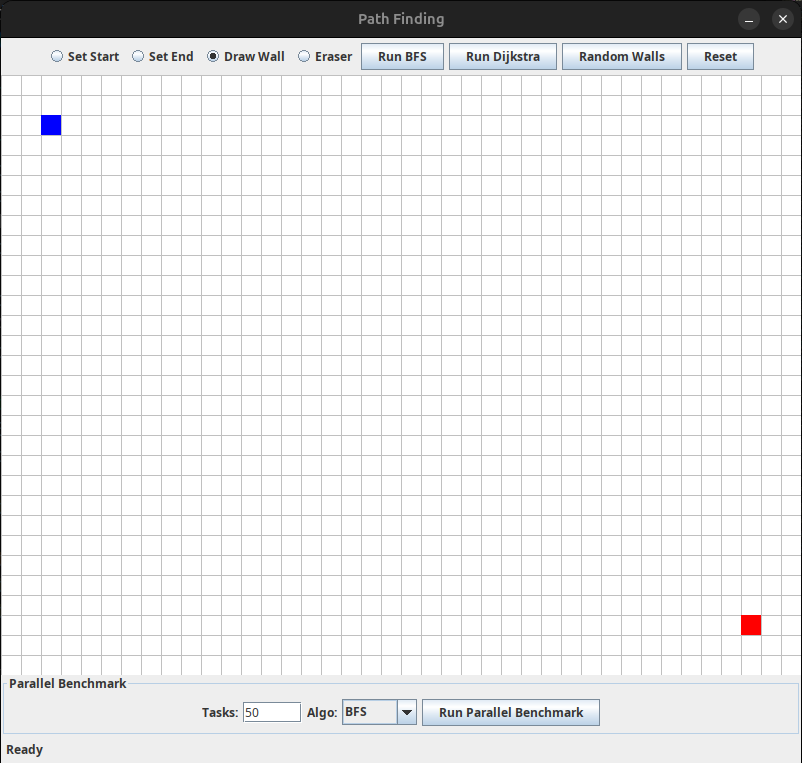
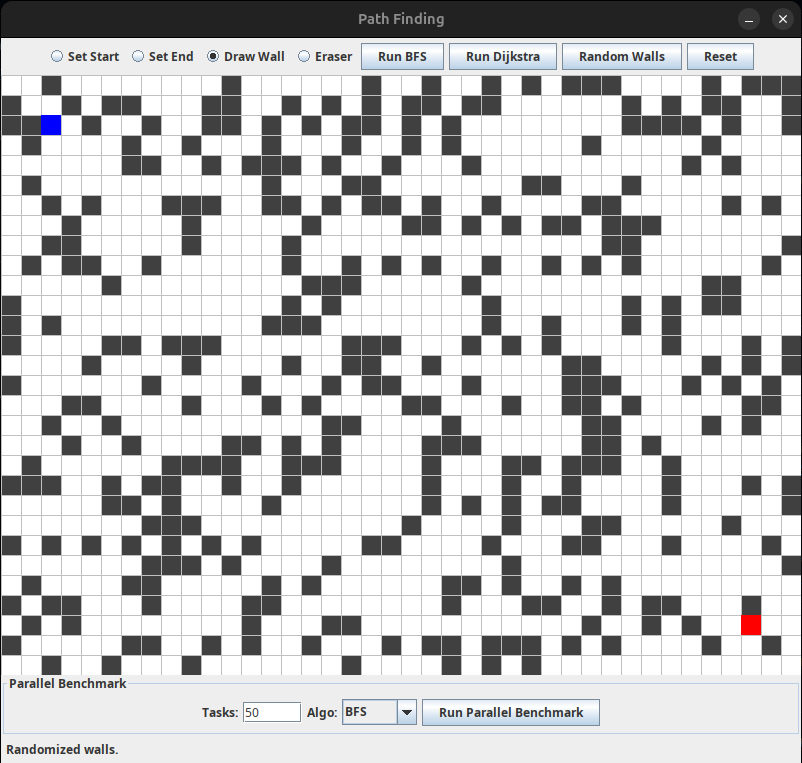
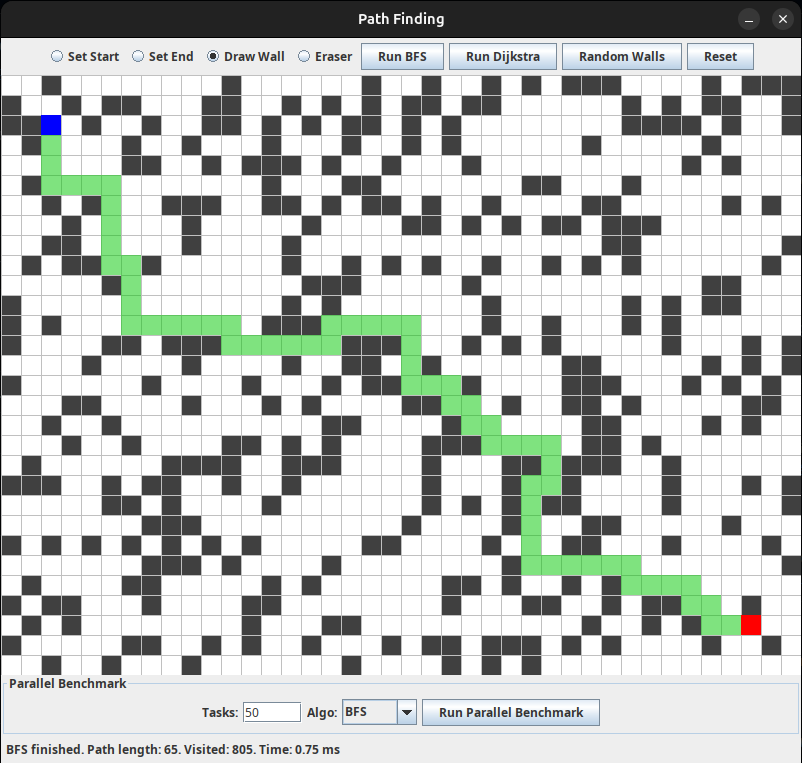
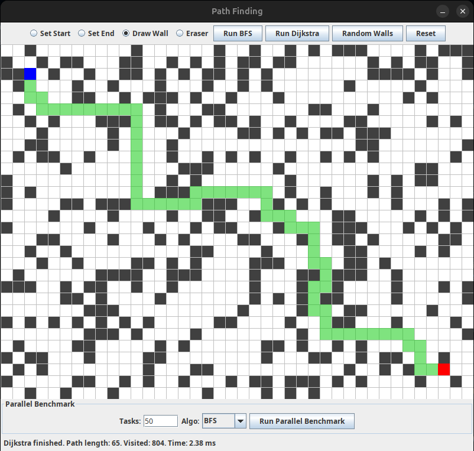

# 🧭 Parallel Pathfinding Visualizer  
A Java Swing GUI application for visualizing pathfinding algorithms (BFS & Dijkstra) with full support for parallel benchmarking using ExecutorService.

---

## 📌 Features
- Draw a 30×40 grid.
- Set **Start** and **End** points.
- Draw or erase **Walls**.
- Run:
  - **BFS**
  - **Dijkstra**
- Random wall generation.
- Full grid reset.
- Parallel Benchmark comparing:
  - Sequential Execution
  - Parallel Execution using ExecutorService

---

## 🗂 Project Structure

parallel_project/
│
├── PathfindingGUI.java ← Main GUI
├── PathfindingEngine.java ← BFS & Dijkstra implementations
├── PathfindingExecutor.java ← Parallel executor (ExecutorService)
├── PathfindingTask.java ← A single pathfinding callable task
├── PathResult.java ← Result object (path, time, visited)
│
├── BenchmarkRunner.java ← (Optional) Benchmark launcher
├── BenchmarkResult.java ← Benchmark data structure
│
└── README.md

---

## 🚀 How to Run

### Requirements
- Java 8 or higher
- Any IDE (IntelliJ / Eclipse)  
Or run from terminal:

javac *.java
java PathfindingGUI

---

## 🎮 How to Use the GUI
### Tools (Top Menu)
- **Set Start** → Select start point  
- **Set End** → Select end point  
- **Draw Wall** → Draw obstacles  
- **Eraser** → Remove cells  

### Buttons
- **Run BFS** → Execute BFS  
- **Run Dijkstra** → Execute Dijkstra  
- **Random Walls** → Generate random obstacles  
- **Reset** → Clear everything  

---

## 📸 Screenshots

| **Empty Grid** | **Random Walls** |
|:---:|:---:|
|  |  |

| **BFS Execution** | **Dijkstra Execution** |
|:---:|:---:|
|  |  |

---

## ⚡ Parallel Benchmark
In the bottom panel:

- **Tasks** → Number of search tasks  
- **Algo** → BFS or Dijkstra  
- **Run Parallel Benchmark** → Runs both:
  - Sequential execution  
  - Parallel execution  

Output example:

Seq = 120.55 ms
Par = 38.92 ms
Speedup = 3.09x

---

## 📑 File Descriptions

### PathfindingGUI.java
- GUI rendering
- Mouse interaction
- Runs BFS/Dijkstra
- Runs benchmark

### PathfindingEngine.java
- BFS & Dijkstra algorithms
- Returns PathResult

### PathfindingTask.java
- One executed search task (Callable)

### PathfindingExecutor.java
- Manages parallel execution using threads

### PathResult.java
- Path list
- Visited nodes count
- Execution time

### BenchmarkRunner.java
- Optional external benchmark launcher

---

## 🧑‍💻 Author
Developed by **Ebrahim Azab**  
Pathfinding Visualization & Parallel Benchmark System.

---

## ⭐ Support
If you like this project, consider giving it a ⭐ on GitHub!
